# USERNAME ENUMERATION VIA SUBTLY DIFFERENT RESPONSES

THIS WAS INTERESTING. WHEN BRUTEFORCING, WE CAN FIND OUT WHICH USERNAME IS VALID, TO MAKE THE ATTACK MORE EFFECTIVE. NOW IF THEY SEND SAME STATUS CODE OR CANT FIND OUT USING CONTENT SIZE, WE CAN LOOK IN THE ACTUAL ERROR MESSAGE. IN THIS CASE, VALID USERNAME MISSED A SINGLE (.) , WHICH WE CAN FIND OUT BY GREP EXTRACT OPTION FROM INTRUDER SETTINGS. AFTER FINDING OUT THE USERNAME, REMANING PART IS OUR OLD KNOWN BRUTEFORCE!

    
    
    
    
    

---

# USERNAME ENUMERATION VIA RESPONSE TIMING

LEARNED A INTERESTING THING. WEB APPLICATION CAN BLOCK YOUR IP IF YOU TRY BRUTE FORCE ATTACK! SO, IT CAN BE BYPASSED BY "X-Forwarded-For: value". THIS IS A HTTP HEADER. IN THIS LAB, WE CAN USE THIS AND THE PITCH FORK ATTACK TO FIND OUT THE DELAY FOR VALID USERNAME. WE MAKE THE DELAY BY SETTING A VERY LONG PASSWORD, SO THERE IS A CLEAR GAP BETWEEN INVALID AND VALID. PITCH FORK ATTACK TAKES 2 PAYLOAD AND INSERT THEM SAME TIME, LIKE 1 1 2 2 ETC. AFTER FINDING OUT THE USERNAME, ITS AGAIN, PLAIN OLD BRUTEFORCE, BUT WITH THE PITCHFORK IP SPOOFING!

    
    
    
    
    

---

# BROKEN BRUTE-FORCE PROTECTION, IP BLOCK

USED THE PREVIOUS LAB KNOWLEDGE, OF X-Forwarded-For. BUT WE CAN DO THIS IN THIS WAY TO. THIS LAB LOCKS OUR IP IF THERE IS 3 ATTEMPT WITH WRONG PASSWORD. BUT IT RESETS IF YOU CAN LOGIN SUCCESSFULLY ONCE, EVEN IN YOUR OWN ACCOUNT. SO WE CAN TAKE PITCHFORK, ARRANGE THE LOAD THIS WAY:
1. REAL USERNAME , REAL PASSWORD
2. VICTIM USERNAME, VICTIM POSSIBLE PASSWORD
3. REAL USERNAME , REAL PASSWORD AND SO ON.

    
    
    

---

# USERNAME ENUMERATION VIA ACCOUNT LOCK

SOMETIMES INSTEAD OF IP LOCK, THE ACCOUNT ITSELF CAN BE LOCKED. IN THIS LAB, WE CAN USE THIS ACCOUNT LOCK METHOD TO FIND OUT LEGITAMATE USER FIRST. AFTER THAT, WE CAN SEE THAT ONE PASSWORD BEHAVES SLIGHTLY DIFFERENT THAN OTHER PASSWORD, WHAT IS MEANT BY THAT IS, IT DOESNT SHOW ANY ERROR OR LOCK MESSAGE, SO THE LENGTH IS SLIGHTLY LOW. WE CAN FIND OUT THIS PASSWORD, WAIT FOR THE LOCK TO BE OVER, AND SUCCESSFULLY BREAK IN!

    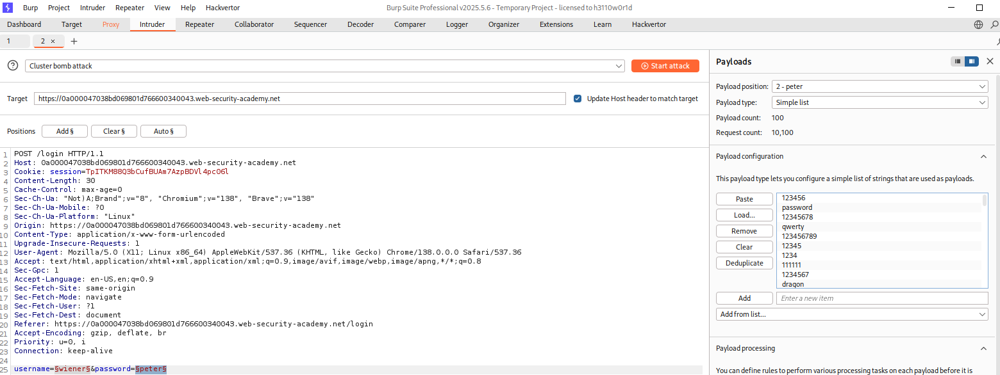
    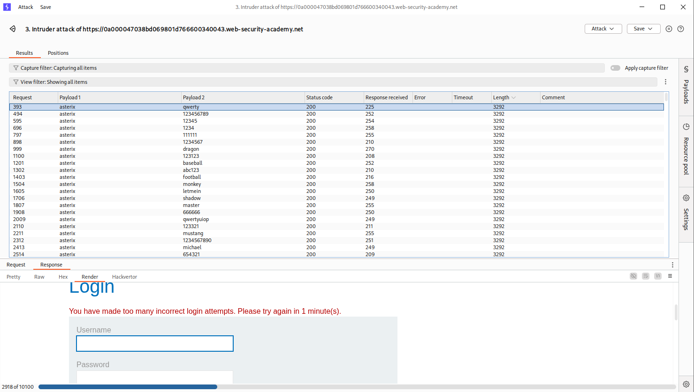
    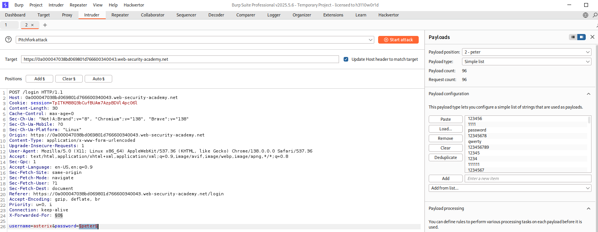
    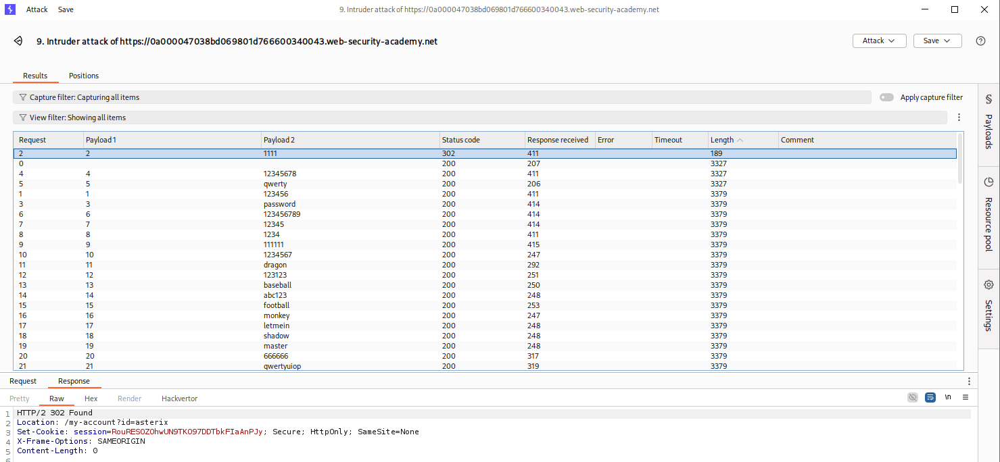
    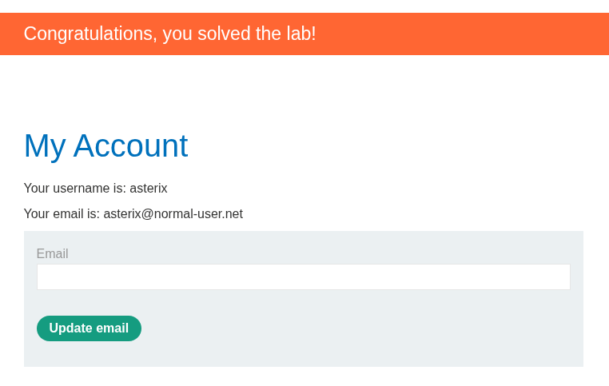

---

# 2FA BROKEN LOGIC

I WAS VERY CLOSE TO SOLVE THIS! SOMETIMES 2FA CAN BE FLAWED, WHERE THEY REALLY DONT CHECK IF IT IS THE SAME USER THAT ENTERING THE 2FA. SO WE CAN LOGIN IN OUR MAIN ACCOUNT, INTERCEPT IT WITH BURPSUITE, CHANGE THE GET REQUEST TO VICTIM, SO IT SENDS A TEMPORARY OTP TO THEM. THEN WE CAN BRUTE FORCE THE CARLOS OTP AND CHECK THE CHANGE IN BURP INTRUDER. AFTER THAT, SIMPLE LOGIN!

    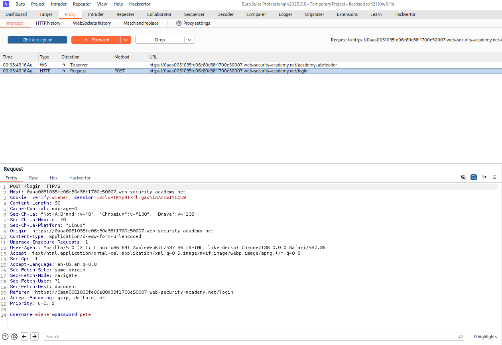
    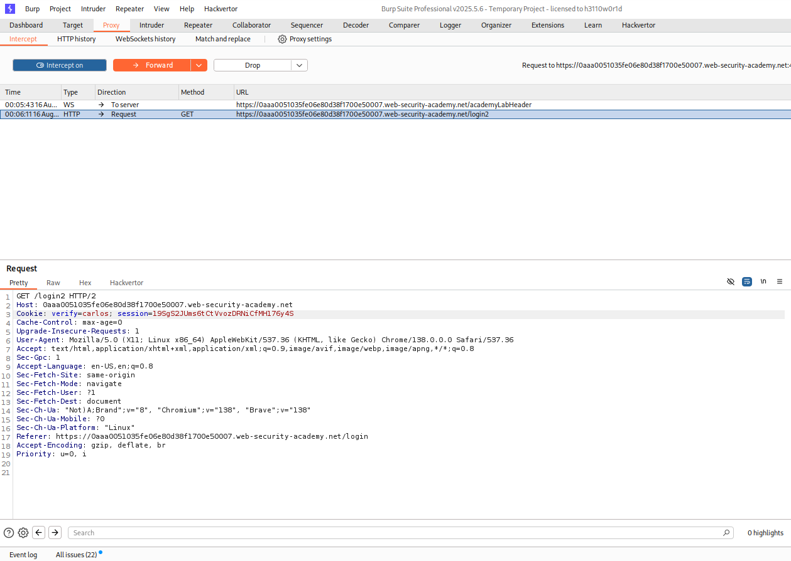
    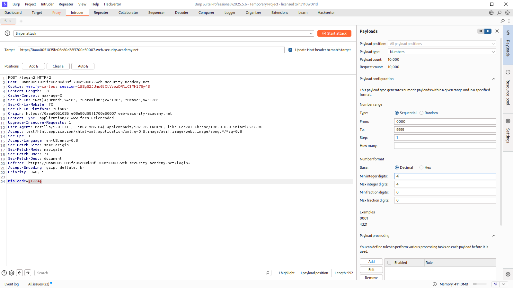
    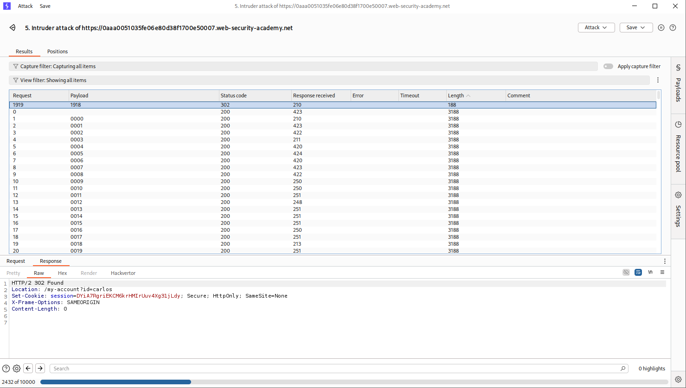

---

# BRUTE-FORCING A STAY-LOGGED-IN COOKIE

SOMETIMES, WEBSITE USES STAY LOGGED IN COOKIE TO REMEMBER A USER. THIS COOKIE, IF VULNERABLE, CAN BE CONSTRUCTED WITH ID AND PASSWORD, BUT MAYBE WITH HASHED MD5 PASSWORD AND BASE64 ENCODED THE WHOLE THING. IN THIS LAB THE STAY IN COOKIE IS LIKE THAT. WE CAN CONFIRM THE COOKIE IS LIKE THIS BY USING DECODER, AND EVEN HACKVERTOR. AFTER CONFIRMING IT, WE CAN BRUTE FORCE THE COOKIE FOR CARLOS. I TRIED MANUAL SETUP FOR THE BRUTEFORCE, WHICH DIDNT WORK EXACTLY, BECAUSE I THINK THEY WANT THE COOKIE ENCODED. SO WE CAN WRITE RULES IN PAYLOAD PREPROCCESSING. IN HERE THE RULES WERE, HASH: MD5 , PREFIX:CARLOS: AND ENCODED BY BASE64. AND THEN, WE CAN RUN BRUTEFORCE AND WE WILL BE LOGGED IN!

    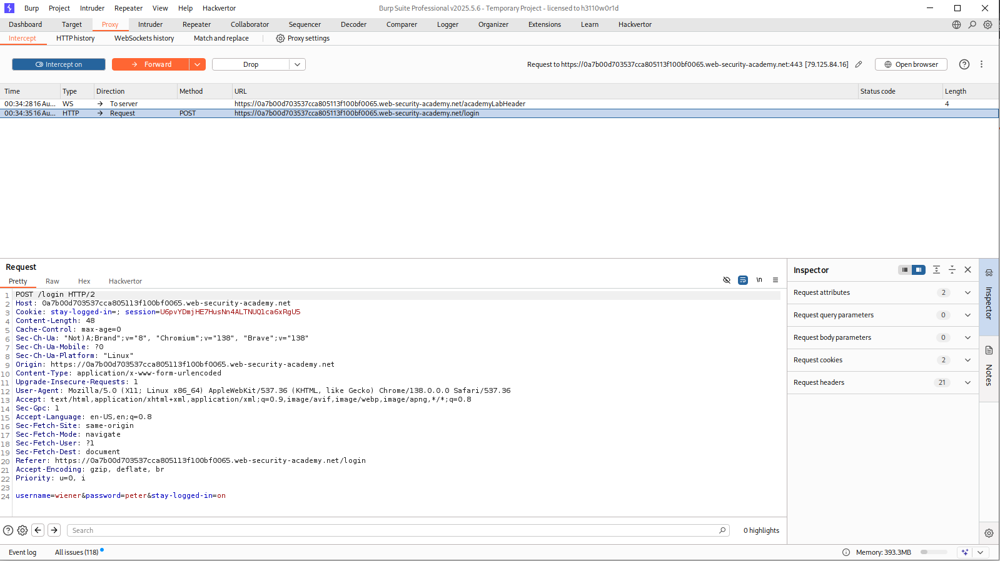
    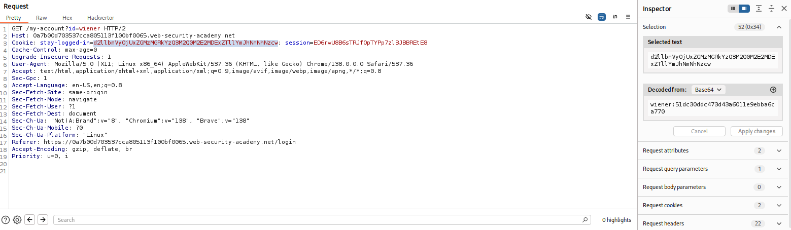
    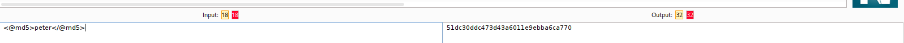
    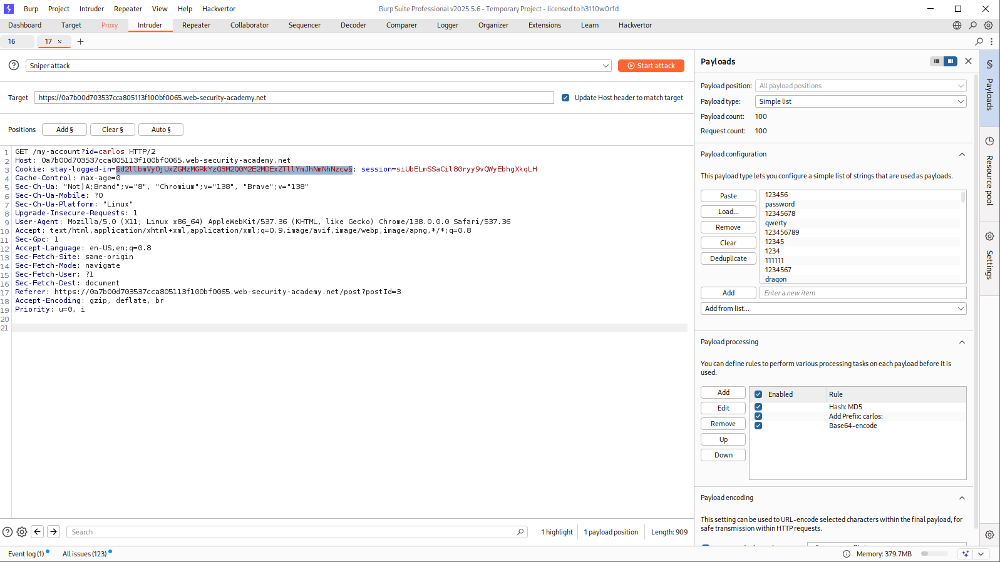
    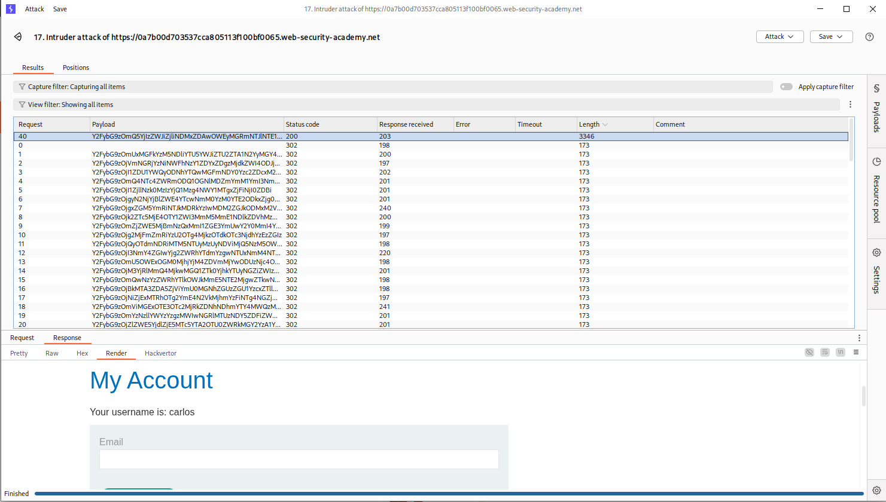

---

# 