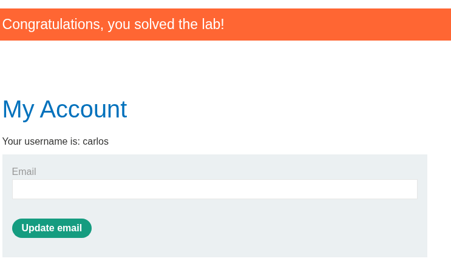

# USERNAME ENUMERATION VIA SUBTLY DIFFERENT RESPONSES

THIS WAS INTERESTING. WHEN BRUTEFORCING, WE CAN FIND OUT WHICH USERNAME IS VALID, TO MAKE THE ATTACK MORE EFFECTIVE. NOW IF THEY SEND SAME STATUS CODE OR CANT FIND OUT USING CONTENT SIZE, WE CAN LOOK IN THE ACTUAL ERROR MESSAGE. IN THIS CASE, VALID USERNAME MISSED A SINGLE (.) , WHICH WE CAN FIND OUT BY GREP EXTRACT OPTION FROM INTRUDER SETTINGS. AFTER FINDING OUT THE USERNAME, REMANING PART IS OUR OLD KNOWN BRUTEFORCE!

    
    
    
    
    

---

# USERNAME ENUMERATION VIA RESPONSE TIMING

LEARNED A INTERESTING THING. WEB APPLICATION CAN BLOCK YOUR IP IF YOU TRY BRUTE FORCE ATTACK! SO, IT CAN BE BYPASSED BY "X-Forwarded-For: value". THIS IS A HTTP HEADER. IN THIS LAB, WE CAN USE THIS AND THE PITCH FORK ATTACK TO FIND OUT THE DELAY FOR VALID USERNAME. WE MAKE THE DELAY BY SETTING A VERY LONG PASSWORD, SO THERE IS A CLEAR GAP BETWEEN INVALID AND VALID. PITCH FORK ATTACK TAKES 2 PAYLOAD AND INSERT THEM SAME TIME, LIKE 1 1 2 2 ETC. AFTER FINDING OUT THE USERNAME, ITS AGAIN, PLAIN OLD BRUTEFORCE, BUT WITH THE PITCHFORK IP SPOOFING!

    
    
    
    
    

---

# BROKEN BRUTE-FORCE PROTECTION, IP BLOCK

USED THE PREVIOUS LAB KNOWLEDGE, OF X-Forwarded-For. BUT WE CAN DO THIS IN THIS WAY TO. THIS LAB LOCKS OUR IP IF THERE IS 3 ATTEMPT WITH WRONG PASSWORD. BUT IT RESETS IF YOU CAN LOGIN SUCCESSFULLY ONCE, EVEN IN YOUR OWN ACCOUNT. SO WE CAN TAKE PITCHFORK, ARRANGE THE LOAD THIS WAY:
1. REAL USERNAME , REAL PASSWORD
2. VICTIM USERNAME, VICTIM POSSIBLE PASSWORD
3. REAL USERNAME , REAL PASSWORD AND SO ON.

    
    
    

---